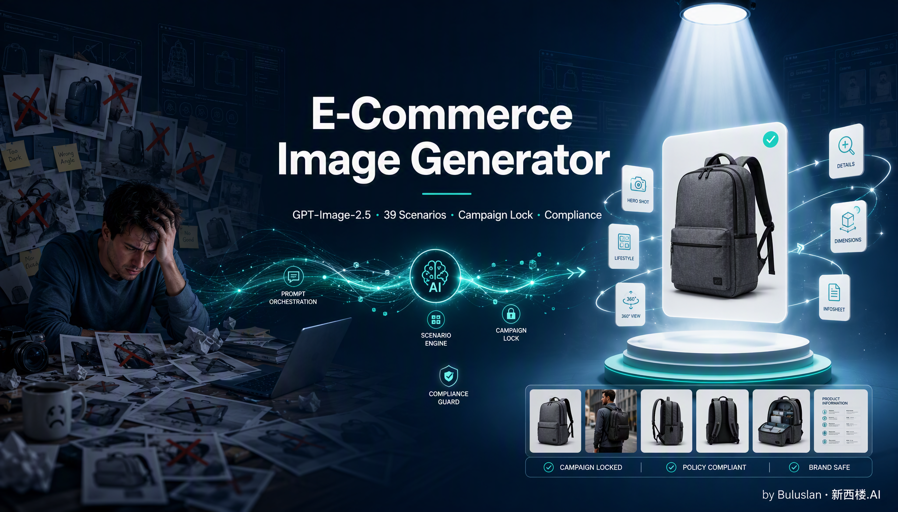

<div align="center">



# 🎨 E-Commerce Image Generator

**GPT-Image-2/2.5 驱动的跨境电商视觉资产生成工具——通道无关，39 个场景模板分钟级出专业产品图**

**想了解更多最新AI行业动态,AI+电商/广告的行业实践方法,人与AI如何协作共生的思考,请关注公众号:【新西楼.AI】**


[](LICENSE)
[](https://docs.anthropic.com/en/docs/claude-code)
[]()
[]()
[]()

**39个电商场景模板 · Provider模型路由 · Campaign套图一致性 · 平台技术预检 · Edit矩阵 · 产品动图 · 反AI感双层过滤**

**Created By Buluu@新西楼.AI**

</div>

---

## 项目简介

你输入产品素材、目标平台和做图需求，E-Commerce Image Generator 会匹配 39 个场景模板，组装可复用的生成或编辑提示词，再按你配置的端点与模型输出图片；随后用脚本检查白底、前景占比与 OCR 状态，并给出需要人工确认的平台风险，最后交付图片、提示词包和检查结果。

> [!TIP]
> **更多跨境电商 AI 实战内容，请关注公众号「新西楼.AI」**

作为 **Agent 原生** 工具，他适配 Claude Code、Codex、Cursor、OpenClaw 等主流 AI Coding Agent，bash + jq + curl 就能跑。**通道无关**——出图端点你自己定：官方 OpenAI、任何 OpenAI 兼容中转、云网关都行；一个 key 都没有也能用（导出 prompt 包，贴进 ChatGPT 就出图）。

---

## ✨ 它做什么

### 39 个电商场景模板

覆盖电商视觉素材全链路 + Edit 能力：

| 类别 | 场景 |
|------|------|
| 产品展示 | 白底主图 hero / 生活场景 lifestyle / 平铺 flat-lay / 细节微距 / 多角度网格 / 隐形模特 / 创意概念 / 奢华氛围 |
| 营销内容 | 海报 banner / 社交媒体 / UGC 买家秀 / 模特展示 / 直播间 / 季节营销 / 运动广告 / 杂志编辑风 / 礼盒节日 |
| 信息与规格 | A+ 模块（970x600）/ 卖点信息图 / 尺寸规格图 / 对比图（vs 竞品）/ 品牌故事 / 包装展示 / 开箱流程 |
| **Edit 矩阵** | 换背景 / 换色（SKU 变体）/ 换季 / 本地化 / 蒙版局部改——明确保留项，尽量减少无关变化 |
| **动图与批量** | 产品动图 motion-gif（16 格帧图→GIF/WebP）/ 爆款换品 bulk-product-swap / 保版式批量翻译 bulk-translate / 透明抠图 transparent-cutout |

（完整触发词路由表见 SKILL.md Step 2）

### Provider 模型路由

如果你的服务商提供 **Flare / Sunburst** 这类模型别名，Skill 会按“探索草稿 / 保真定稿”给出路由建议；它们不是所有 OpenAI 兼容端点都具备的标准模型名。最终可用模型、质量档和价格以你所用端点的文档与实时账单为准，详见 `references/model-routing.md`。

### 平台技术预检

它提供的是技术预检与风险提示，不是平台审核或法律结论：

- **平台硬约束**：Amazon / TikTok Shop / Shopify / 速卖通 + Temu 的主图技术规范（A 类主图 RGB(255,255,255) 纯白底 / 占比 ≥85% / 无文字 Logo / 1:1 / ≥1000px）
- **AIGC 法规追踪**：纽约 SB 8420-A / FTC / 加州 SB 942 + EU AI Act Art 50，含罚款金额 + 卖家硬要求
- **`compliance_check.py` 自动检测**：背景白度 / 前景占比 / OCR 文字；OCR 缺失会明确标为 skipped，不能视为通过
- **图类型 4 分类**：A 实拍无人 / B 常规修图 / C 写实 AI 人物（必勾披露）/ D 复刻真人（主动拦截）
- **三不红线**：不剥离 C2PA / SynthID、不教唆规避 AI 标注、不造假实拍

### Campaign Style Lock 套图一致性

**模板只是起点，一致性才是成品感**——10 字段 Lock + 6 层漏斗编排，用来降低整套 listing 从主图到包装的视觉漂移：

- **10 字段锁定协议** + prepend 机制：一套图从主图到包装视觉不漂移
- **6 层漏斗 9 槽位套图编排**：精细模式（逐槽位编排）与快速通道（单 prompt 整套）双路线
- **region 适配**：US / EU / SEA / CN / ME 审美查表

### 反 AI 感双层过滤

prompt 文字层（slop 词过滤 + 五要素组装法则）+ 视觉层（8 类 AI-tell 特征识别），核心工艺原理见 `references/craft.md`。

---

## 🚀 快速开始

### 出图通道（任选其一，通道无关设计）

**api 模式（推荐）**——任何 OpenAI 兼容端点，三个环境变量：

```bash
export IMAGE_API_BASE="https://api.openai.com"   # 或你的中转/网关 base
export IMAGE_API_KEY="sk-xxx"                     # 兼容旧变量 OPENAI_API_KEY
export IMAGE_MODEL="gpt-image-2.5-flare"          # 精修编辑用 gpt-image-2.5-sunburst
```

官方 OpenAI、各类 OpenAI 兼容中转、云网关（Vercel AI Gateway / Cloudflare Workers AI 等）均可；参考图自动走 `image_urls`，端点不认时自动回退官方 `/v1/images/edits`。

**manual 模式（零通道）**——不配任何 API，导出 prompt 包贴进 ChatGPT 或自己 curl。

**cli 模式**（codex exec）已 DEPRECATED legacy。

### 安装

```bash
git clone https://github.com/buluslan/gpt-image2-ecommerce.git ~/.claude/skills/ecom-image2
cd ~/.claude/skills/ecom-image2
```

通用依赖：bash 3.2+、jq、curl、base64、awk（Mac/Linux）。技术预检另需 Python 3.9+ 与 Pillow；OCR 还需 pytesseract 和 tesseract，缺失时会明确降级。

> API 模式会把产品图和参考图上传到你配置的端点。请只使用你有权上传的素材，并先确认端点的数据保留与隐私条款。

### 用法一：在 Agent 中（推荐）

放进 Claude Code skills 路径（Codex / Cursor 用户：把 SKILL.md 当指令喂给 agent 即可），直接描述需求：

```
帮我生成一张电动自行车的运动广告图，暗色背景，速度感
做一套 5 张风格一致的亚马逊 Listing 套图（主图+场景+卖点+对比+包装）
给这个产品做个动图，主图动效那种自动循环的
把这套爆款图换成我的产品，版式全保留
```

Agent 会自动匹配模板、组装 prompt、按端点能力建议模型、经你配置的通道生成图片，并做技术预检。

### 用法二：直接命令行

```bash
# api 模式出图
bash scripts/imagegen.sh \
  --prompt-file <(echo '{"subject":"frosted glass serum bottle","scene_type":"product photography"}') \
  --size 1024x1024 --quality high --mode api

# manual 模式导出 prompt 包（零通道）
bash scripts/imagegen.sh --prompt-file prompt.json --mode manual --output ./my-prompt-pack

# 技术预检（出图后）
python3 scripts/compliance_check.py generated.png --platform amazon --strict | jq .
```

stdout 是单个 JSON envelope（`jq .data.images` 解析，通道返回成本时 `data.cost` 透出）。

---

## 🧠 底座

- **五要素组装法则**：每条生产级 prompt = subject + material + light + lens/ratio + finish 的短生产简报（「材质优先于形容词」）
- **编辑保真工艺**：change only X + preserve list 逐项写——模型不知道你的业务底线，漏写的项就是会被改掉的项
- **文字渲染三招**：引号包裹 + ALL CAPS / 逐字母回退 / no extra words（官方 prompting guide 同款建议）
- 详细原理见 `references/craft.md`（「为什么」层，不堆规则）

---

## 🏠 交流社区

<div align="center">

🎯 **更多 AI 实战教程和专属福利尽在我们「MBG 跨境AI实战圈」,已有 50+ 跨境大卖、AI 专家热聊中**

—— 欢迎跨境电商从业者加入我们,一起探索 AI+商业的最佳实践和真实边界,跑通【跨境AI】的从 0 到 1,打败你的同事,干掉你的老板。

**社区介绍:[my.feishu.cn/wiki/WNi0wh3mIiOLhzkCLFPcwUr9nrg](https://my.feishu.cn/wiki/WNi0wh3mIiOLhzkCLFPcwUr9nrg)**


</div>

---

## 📁 结构

```
gpt-image2-ecommerce/
├── SKILL.md                        # Skill 入口（7 步 workflow + 场景路由表）
├── README.md / CHANGELOG.md / LICENSE
├── scripts/
│   ├── imagegen.sh                 # 通道无关生成入口（api/manual/cli + 工程硬化）
│   └── compliance_check.py         # 主图技术预检
├── references/
│   ├── scenarios/                  # 39 个场景模板（JSON）
│   ├── model-routing.md            # 2.5 双模型选型与成本心智
│   ├── motion-gif.md               # 产品动图完整方法论
│   ├── craft.md                    # 做图工艺原理（五要素/文字/编辑保真）
│   ├── campaign-style-lock.md      # 套图一致性协议
│   ├── funnel-set.md               # 套图编排漏斗
│   ├── style-blacklist.md          # 品类×风格冲突 + slop 词
│   └── platform-constraints.md     # 平台合规硬约束
├── assets/                         # banner + 默认样式 Lock 基线
└── evals/                          # 11 个测试用例
```

## 🙏 Credits

- 产品动图方法论参考并改造自开源项目 [liangdabiao/product-motion-gif](https://github.com/liangdabiao/product-motion-gif)
- 透明抠图配方来自 [OpenAI 官方 prompting guide](https://developers.openai.com/api/docs/guides/image-prompting)

---

## 📖 写在最后

<div align="center">

**如果这个工具帮到了你,欢迎 ⭐ Star 支持。更多 AI × 跨境电商实操内容,关注公众号「新西楼.AI」。**

</div>

---

## 📜 License

MIT License — 见 [LICENSE](LICENSE)
